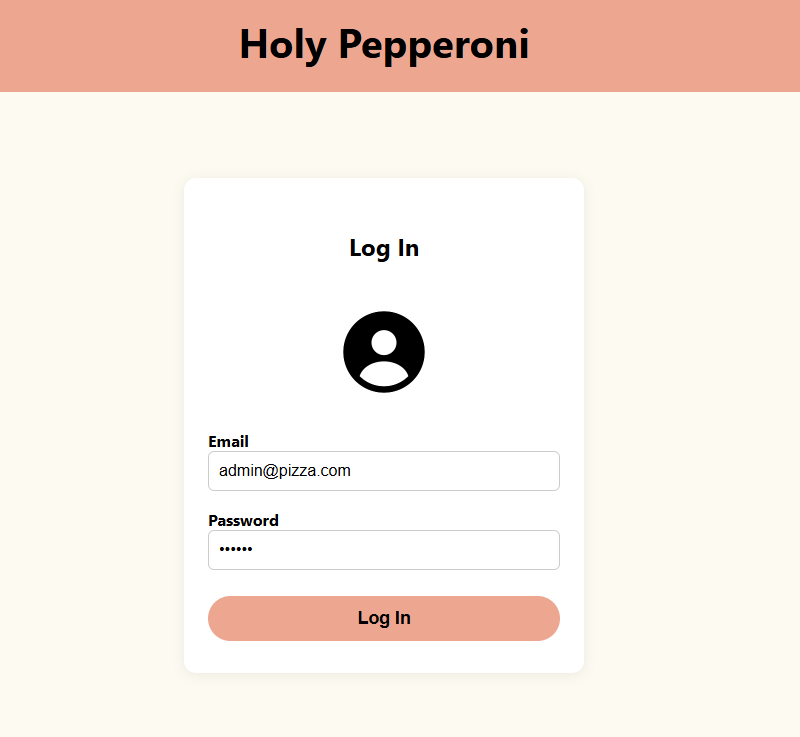
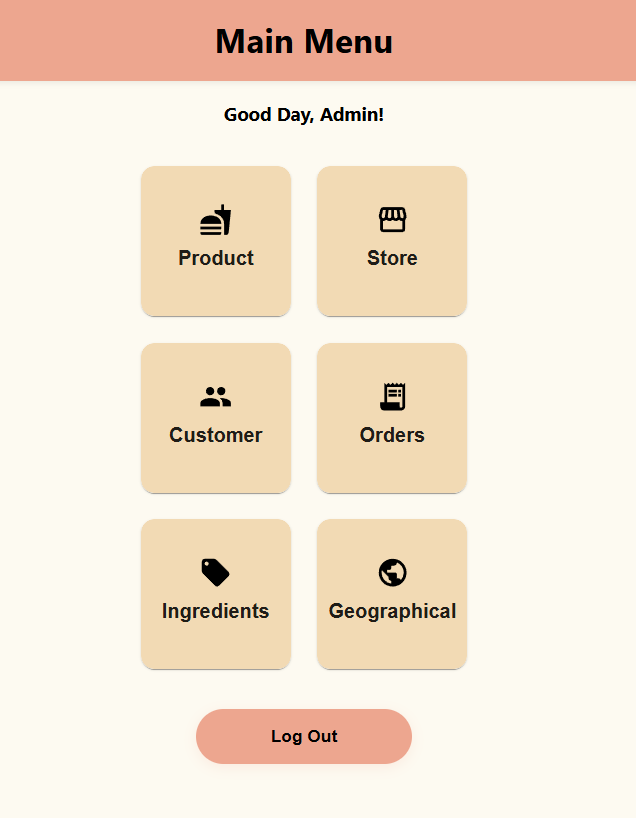
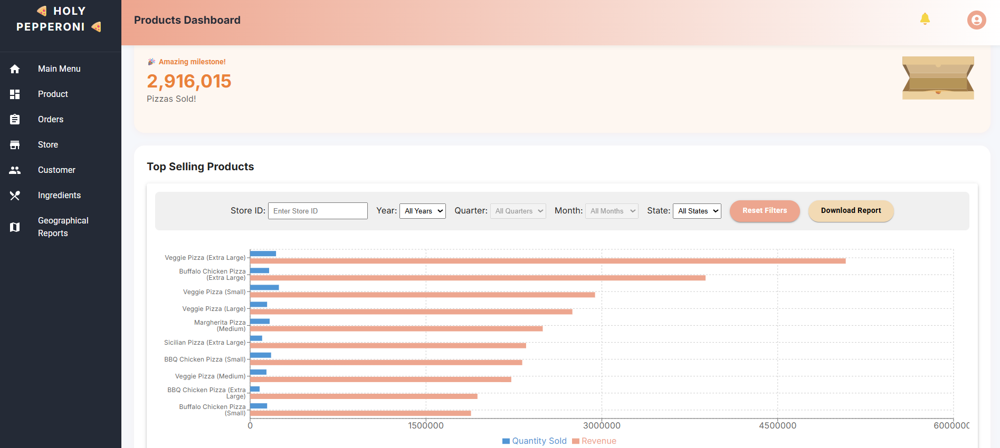
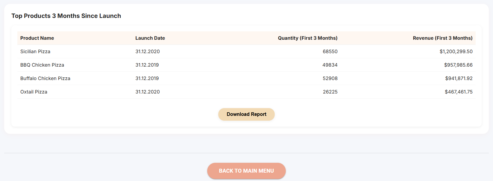
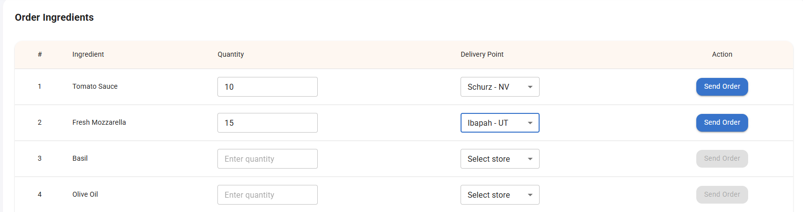
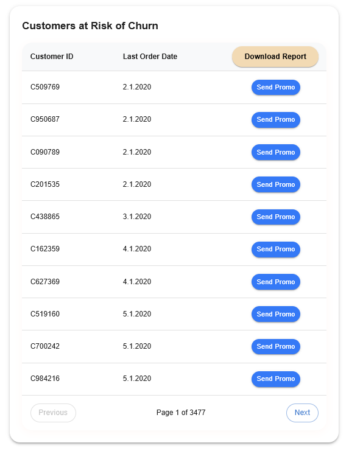
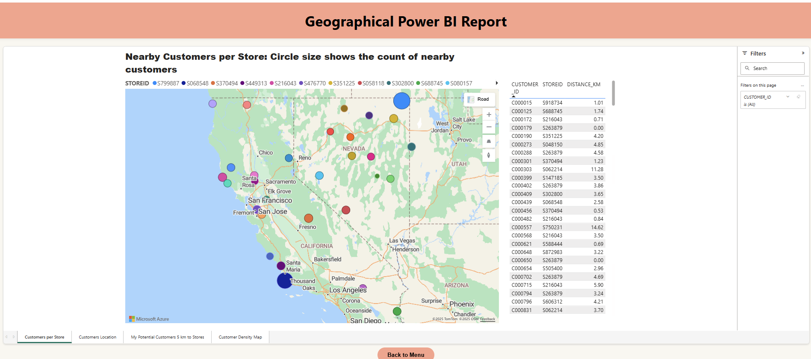

# 🍕 Pizza Web App – Holy Pepperoni Dashboard

[](https://react.dev/) 
[](https://nodejs.org/) 
[](https://www.oracle.com/database/)  
[](https://powerbi.microsoft.com/)

A **full-stack business analytics application** that visualizes sales and business data for a fictional pizza company.  
The app connects a **React frontend** with a **Node.js/Express backend** and uses an **Oracle database** to provide **KPIs and interactive dashboards**.

---

## 🚀 Features

- **Login / Authentication** (Admin)  
- **KPI Dashboard**: Revenue, sales figures, product performance, customer data  
- **Interactive visualizations** with **Recharts**  
- **Data management** for stores, products, orders, customers  
- **Filter functions** for detailed analysis  
- **Responsive UI** for desktop and tablet  

---

## 🖼 Screenshots


  






---

## 🛠 Tech Stack

| Layer     | Technology                |
|-----------|---------------------------|
| Frontend  | React, Recharts, CSS      |
| Backend   | Node.js,                  |
| Database  | Oracle Database           |
| Tools     | Power BI, Git, npm        |

---

## 📂 Architecture & Data Model

The system is based on a classic **3-tier architecture**:

1. **Frontend** – React app with Recharts for visualization  
2. **Backend** – Node.js REST API as interface to the DB  
3. **Database** – Oracle XE with relational schema  

### Database Entities

- **Orders** – Orders with date, quantity, product, store, customer  
- **Products** – Product data (name, category, price)  
- **Stores** – Store locations  
- **Customers** – Customer data 
- **Ingredients** – Ingredients  

---

## ⚙️ Requirements

- **Node.js** ≥ 14  
- **npm** ≥ 6  
- **Oracle Database XE 21c** (or compatible)  
- Modern browser (Chrome, Edge, Firefox)  

---

## 📁 Step 1: Download Project Files

Clone or download the project files into a main directory. This should include:

- `pizza_schema.dmp` (database dump file)
- `holy-pepperoni/` (React frontend)
- `backend/` (Node.js backend)

```bash
git clone [<your_repository_url>](https://github.com/ioanaxcarmen/Pizza-Web-App)
cd <your_project_folder>
```

---

## 🛠️ Step 2: Oracle Database Setup

### 1. Create Import Directory

- Create a folder at `C:\oracle_import`.
- Place your `pizza_schema.dmp` file inside it.

### 2. Create Database User & Directory Object

Open **Command Prompt or PowerShell as Administrator**, then connect using `SQL*Plus`:

```bash
sqlplus system/YourAdminPassword@localhost:1521/XEPDB1
```

Execute the following SQL statements:

```sql
CREATE USER PIZZA IDENTIFIED BY MyPizza123;
GRANT CONNECT, RESOURCE, CREATE_MATERIALIZED_VIEW TO PIZZA;
ALTER USER PIZZA QUOTA UNLIMITED ON USERS;

CREATE OR REPLACE DIRECTORY DMP_DIR AS 'C:\oracle_import';
GRANT READ, WRITE ON DIRECTORY DMP_DIR TO PIZZA;
EXIT;
```

### 3. Import the Database Dump

In the same Admin terminal:

```bash
impdp PIZZA/MyPizza123@localhost:1521/XEPDB1 DUMPFILE=pizza_schema.dmp DIRECTORY=DMP_DIR LOGFILE=import.log
```

Wait for it to finish. If there are no critical errors, your database is ready.

---

## ⚙️ Step 3: Application Configuration

### 1. Backend

- Go to the `backend/` directory.
- Open `server.js`.
- Make sure the `dbConfig` uses the correct `connectString`:

```js
const dbConfig = {
  user: "PIZZA",
  password: "MyPizza123",
  connectString: "localhost:1521/XEPDB1", // Use the PDB for app data
  // connectString: "localhost:1521/XE" // Commented out - root container
};
```

### 2. Frontend

- Go to the `holy-pepperoni/` directory.

```env
REACT_APP_API_URL=http://localhost:3001 --> replace localhost with current IP address to make it accessible from other devices
```

---

## ▶️ Step 4: Run the Application

You’ll need **two terminal windows** open.

### Terminal 1 – Start Backend Server

```bash
cd path/to/your/project/backend
npm install
node server.js
```

✅ You should see:
```
Backend server running at http://localhost:3001 
```

### Terminal 2 – Start Frontend (React)

```bash
cd path/to/your/project/holy-pepperoni
npm install
npm start -- --host 0.0.0.0
```

✅ A browser window should open automatically.

---

## 🔐 Step 5: Using the Web App

### 1. Log In

Use these Firebase credentials:

- **Email:** `admin@pizza.com`
- **Password:** `pizza1`

### 2. Navigate

After logging in, use the menu to go to:

- Products
- Stores
- Customers
- Ingredients
- Orders
- Geographical Reports

### 3. Analyze Data

On KPI pages:

- Use filters to slice data.
- Click chart elements to drill down into details.

---

## 🧀 Enjoy your pizza-powered insights!
